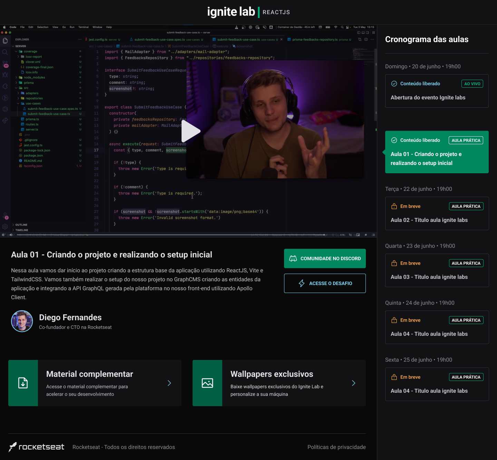

# Event Platform

Event platform powered by ReactJS and GraphQL at Ignite Lab.

## Preview


<br>
<br>
## Technologies

<div style="display: inline_block">
  <a href="https://reactjs.org/" target="_blank">
    
  </a>
  <a href="https://www.typescriptlang.org/" target="_blank">
    
  </a>
  <a href="https://graphql.org/" target="_blank">
    
  </a>
  <a href="https://tailwindcss.com/" target="_blank">
    
  </a>
  <a href="https://www.apollographql.com/docs/react/" target="_blank">
    
  </a>
</div>
<br>
<br>

## Usage

### Install

You need to install [Yarn](https://yarnpkg.com/) to run this project.

### Clone the project

```bash
$ git clone https://github.com/brunomart97/ignite-lab-event-platform.git
```

### Follow the steps

```bash
# Access the folder
$ cd ignite-lab-event-platform

# Install the dependencies
$ yarn

# Run the project
$ yarn run dev
```

The application will be available at `http://localhost:3000`\
<br>

## Author

<p>
  
  <br />
  <sub><strong>Bruno Martins da Silva</strong></sub>
</p>

<a href="https://www.linkedin.com/in/brunomart97" target="_blank">
  
</a>
